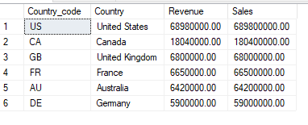
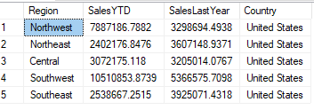

1. What is the regional sales in the best performing country?

1. To find the best performing country, I find the country which has highest sales and revenue in total by JOIN 2 VIEW **Sales.vStoreWithDemographics**  and **Sales.vStoreWithAddresses**    using BusinessEntityID                      

SELECT c.CountryRegionCode AS Country\_code, a.CountryRegionName AS Country, SUM(d.AnnualRevenue) as Revenue, SUM(d.AnnualSales) AS Sales

FROM Sales.vStoreWithAddresses AS a

`	`INNER JOIN	Sales.vStoreWithDemographics AS d

`	`ON a.BusinessEntityID = d.BusinessEntityID

`	`INNER JOIN Person.CountryRegion AS c

`	`ON c.Name = a.CountryRegionName

GROUP BY a.CountryRegionName, c.CountryRegionCode

ORDER BY Revenue DESC, Sales DESC;

Here is the result:

Then I just pick the best performing country by select top 1 of that results, and that is United States

1. I use the query above as a CTE to join with the **SalesTeritory** table using Country\_code to find out what are the regional sale in the United State

WITH sales\_per\_country AS (

SELECT TOP 1 c.CountryRegionCode AS Country\_code, a.CountryRegionName AS Country, SUM(d.AnnualRevenue) as Revenue, SUM(d.AnnualSales) AS Sales

FROM Sales.vStoreWithAddresses AS a

`	`INNER JOIN	Sales.vStoreWithDemographics AS d

`	`ON a.BusinessEntityID = d.BusinessEntityID

`	`INNER JOIN Person.CountryRegion AS c

`	`ON c.Name = a.CountryRegionName

GROUP BY a.CountryRegionName, c.CountryRegionCode

ORDER BY Revenue DESC, Sales DESC)

SELECT t.Name as Region, 

`		`t.SalesYTD, 

`		`t.SalesLastYear, 

`		`s.Country

FROM Sales.SalesTerritory AS t

INNER JOIN sales\_per\_country AS s

`	`ON t.CountryRegionCode = s.Country\_code;

And here is the result of the query:

