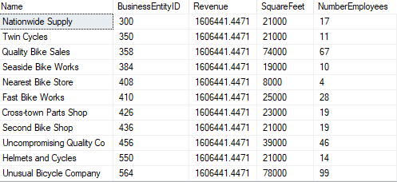

\6. What is the relationship between the size of the stores, number of employees and revenue?

I need 3 information, revenue, number of employees and size of stores.

I use the TotalDue in SalesOrderHeader table as the revenue.

To find Store Name, I join the SalesOrderHeader table with Sales.Store using SalesPerson ID. I also have the Store’s BusinessEntityID in Sales.Store.

To find Store size and number of employees, I use the view Sales.vStoreWithDemographics. I join the Sales.Store with the view using BusinessEntityID.

` `SELECT 

`	`s.Name,

`	`s.BusinessEntityID, 

`	`SUM(o.TotalDue) as Revenue,   

`	`d.SquareFeet, 

`	`d.NumberEmployees

FROM Sales.SalesOrderHeader AS o

INNER JOIN Sales.Store AS s

`	`ON o.SalesPersonID = s.SalesPersonID

INNER JOIN Sales.vStoreWithDemographics AS d

`	`ON s.BusinessEntityID = d.BusinessEntityID

GROUP BY o.SalesPersonID, s.BusinessEntityID, s.Name, d.SquareFeet, d.NumberEmployees

ORDER BY Revenue;

And this is the result of the query:

5 columns, 701 rows.
